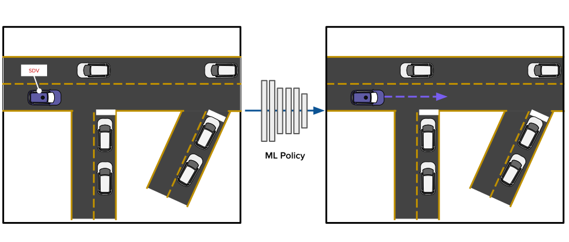

# Introduction to Planning for Self Driving Vehicles
Planning is an essential piece of the Autonomous Vehicles (AV) stack.

In this series of notebooks you will train and evaluate a data-driven ML policy.

**Before starting, please download the [Lyft L5 Prediction Dataset 2020](https://self-driving.lyft.com/level5/prediction/) and follow [the instructions](https://github.com/lyft/l5kit#download-the-datasets) to correctly organise it.**

Training an effective ML policy for planning can takes several hours on the most performing hardware.
For this reason, we provide trained models you can experiment with in our evaluations notebooks,
without requiring to train one yourself. Still, we suggest you to go through the training notebook we provide,
as it contains key insights on how to effectively train a ML policy for planning.

# [Training Notebook](./train.ipynb)

In this notebook you are going to train your own ML policy to fully control a Self Driving Vehicle (SDV). You will train your model using the Lyft Prediction Dataset and L5Kit

The policy will be a deep neural network (DNN) which will be invoked by the SDV to obtain the next command to execute.

More in details, you will be working with a CNN architecture based on ResNet50.

#### Inputs
The network will get a BEV of the scene surrounding the SDV as the only input. This has been rasterised in a fixed grid image to comply with the CNN input. L5Kit is shipped with various rasterisers. Each one of them captures different aspects of the scene (e.g. lanes or satellite view).

This input representation is very similar to the one used in the [prediction competition](https://www.kaggle.com/c/lyft-motion-prediction-autonomous-vehicles/overview). Please refer to our [competition baseline notebook](../agent_motion_prediction/agent_motion_prediction.ipynb) and our [data format notebook](../visualisation/visualise_data.ipynb) if you want to learn more about it.

#### Outputs
The network outputs the driving signals required to fully control the SDV. In particular, this is a trajectory of XY and yaw displacements which can be used to move and steer the vehicle.

After enough training, your model will be able to drive the SDV along a specific route. Among others, it will do lane-following while respecting traffic lights.

# Pre-Trained Models
We provide a collection of pre-trained models you can experiment with and use in your own experiments.
Please refer to the [training notebook](./train.ipynb) for additional details and download links.

# [Open-Loop Evaluation Notebook](./open_loop_test.ipynb)

In this notebook you are going to evaluate a CNN-based policy to control the SDV with a protocol named *open-loop* evaluation.

## What is open-loop evaluation?
In open-loop evaluation we evaluate our model prediction as we follow the annotated ground truth.

In each frame, we compare the predictions of our model against the annotated ground truth. This can be done with different metrics.

**Regardless of the metric used, this evaluation protocol doesn't modify the future locations according to the model's predictions.**

# [Closed-Loop Evaluation Notebook](./closed_loop_test.ipynb)
In this notebook you are going to evaluate a CNN-based policy to control the SDV with a protocol named *closed-loop* evaluation.

## What is closed-loop evaluation?
In closed-loop evaluation the model is in **full control of the SDV**. At each time step, we predict the future trajectory and then move the AV to the first of the model's predictions. 

We refer to this process with the terms **forward-simulate** or **unroll**.

